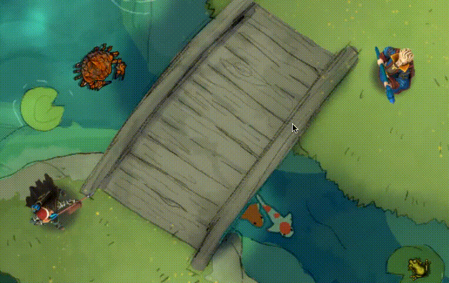

# QuickScale

_A small module for quickly adjusting the scale of things._

---

Select elements in a scene, then use the square bracket keys to tweak them (with or without `Shift` for different effects).

Brief video overview here: [https://www.youtube.com/watch?v=SqG9uuHQA2s](https://www.youtube.com/watch?v=SqG9uuHQA2s)

---

### Controls

All keybinds can be configured in the core Configure Controls window. Keys listed below are the defaults.

### Tokens & Tiles

- `[` and `]` will adjust tokens or tiles incrementally. **PF2E Note:** If you have `Link to Actor Size` enabled in a token's configuration, QuickScale will not be able to change that token's scale. **V12 Note:** These keys conflict with the core defaults for `Send Objects to the Back/Front`. If you want to use those, you'll have to rebind one or the other.
- Will work with multiple selections.
- `Shift + [` will apply a small amount of random scaling to all controlled tokens or tiles.
- `Shift + ]` will apply a small amount of random rotation.]
- If one or more tokens are controlled, `Shift + \` will save the tokens' current scale to their actors' Prototype Token config.
- `Alt + [` will nudge the token art down relative to the grid square (useful for isometric-style artwork). Note that there are controls for offset distance ("Anchor") in core Foundry v12; when in v12, use those instead.
- `Alt + ]` will nudge up.
- `Alt + Shift + [` will nudge down in larger steps.
- `Alt + Shift + ]` nudges up in large steps.
- `Alt + \` will reset the nudged offset to zero.

### Lights & Sounds

- `[` and `]` will adjust their radius in 1-grid-unit steps.
- `Shift + [` and `Shift + ]` will adjust them in 5-grid-unit steps.
- Lights can be adjusted into the negative, to create Darkness lights.

### Templates

- Same controls as for Lights & Sounds, adjusting the `distance` property of templates.
- Is a little weird with rectangles, because of how they're constructed.
- Non-GM/Assistant players may use these controls on their own placed templates.

### Settings

There are a few settings you can adjust:

- _Token Scale Randomization Range_ sets the minimum and maximum scale values that tokens will randomize within.
- _Tile Scale Randomization Range_ sets similar bounds for the tile randomization tool.
- _Maximum Rotation Amount_ sets the bounds for random rotations — a value of 15 here will allow for random changes between -15° and 15°.

### Thanks!

Many thanks to @Jinker for providing the prototype-saving animations — [https://www.patreon.com/jinker](https://www.patreon.com/jinker) — and to everyone who has helped in other ways.
