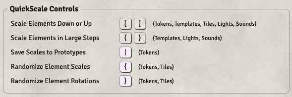
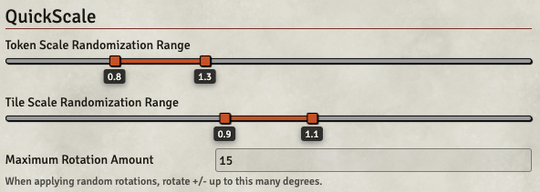

# QuickScale

_A small module for quickly adjusting the scale of things._

---

Select elements in a scene, then use the square bracket keys to tweak them (with or without `Shift` for different effects).

---

### Tokens & Tiles
* `[` and `]` will adjust tokens or tiles incrementally.
* Will work with multiple selections.
* `{` will apply a small amount of random scaling to all controlled tokens or tiles.
* `}` will apply a small amount of random rotation.
* If one or more tokens are controlled, `|` ( which is `Shift + \` ) will save the tokens' current scale to their actors' Prototype Token config.

### Lights & Sounds
* `[` and `]` will adjust their radius in 1-grid-unit steps.
* `{` and `}` will adjust them in 5-grid-unit steps.
* Lights can be adjusted into the negative, to create Darkness lights.

### Templates
* Same controls as for Lights & Sounds, adjusting the `distance` property of templates.
* Is a little weird with rectangles, because of how they're constructed.
* Non-GM/Assistant players may use these controls on their own placed templates.

### Settings
There are a few settings you can adjust:

* _Token Scale Randomization Range_ sets the minimum and maximum scale values that tokens will randomize within.
* _Tile Scale Randomization Range_ sets similar bounds for the tile randomization tool.
* _Maximum Rotation Amount_ sets the bounds for random rotations — a value of 15 here will allow for random changes between -15° and 15°.

Many thanks to @Jinker for providing the prototype-saving animation — https://www.patreon.com/jinker — and to everyone who has helped in other ways.
